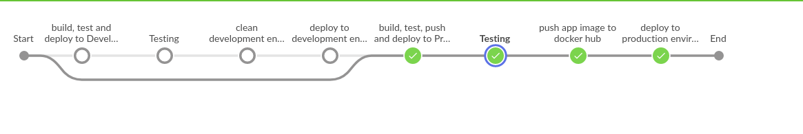

# challenge 3

## **create k8s cluster using this [script](https://github.com/MinaMaher0/Bate5a-Scripts/tree/master/create%20k8s%20cluster)**

## Jenkins pipeline

## Kubernetes folder conatins services and deployments files
